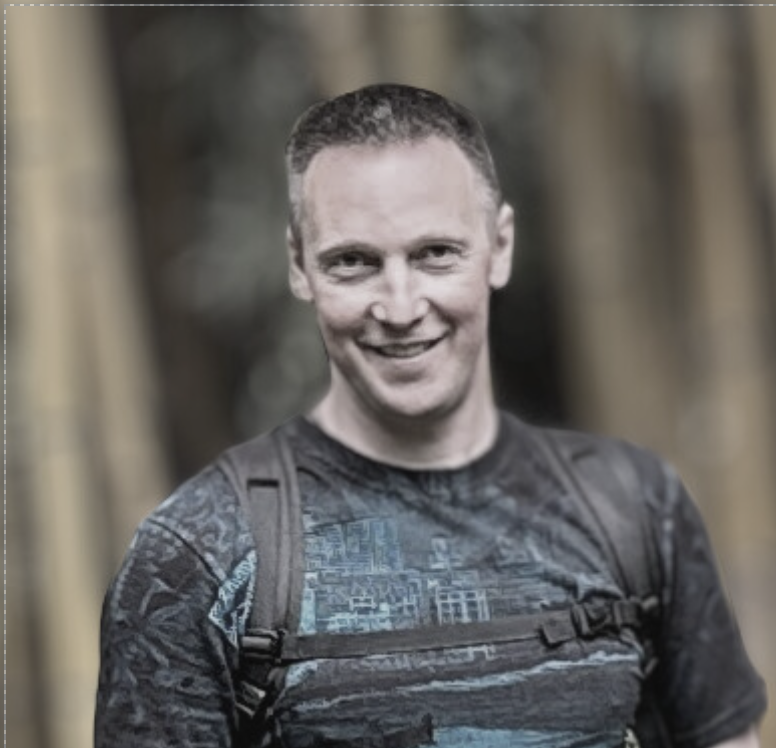

---

# Hello, my name is Igor! 
<table align="center">
  <tr>
    <td>
      <pre><code>
      UAHIG { 
        position: Poland; 
        height: 187cm; 
        display: boy; 
        background: engineer; 
        color: white;
      }
      </code></pre>
    </td>
    <td></td>
   
  </tr>
</table>
---

### Briefly About Myself: 

Currently, I am studying programming, and as a creative individual, I have been inspired by the prospect of working as a Frontend Developer.

 I started my career as a design engineer in 2005. Since 2007, I have been working in an innovative flexible packaging manufacturing company, progressing from a production preparation engineer to the position of Chief Technologist.

I strive for self-improvement and constantly expand my knowledge and skills. My goal is professional growth and achieving outstanding results that contribute to the success of the company. I am willing to take responsibility and work in a dynamic environment where I can make a contribution and develop professionally.


- Java Script learn.javascript.ru Course !

- EPAM Front-End Self-Paced Online Program!

- RS School Course «JavaScript/Front-end. Stage 0» (in progress)
---
### Contact me:  [](https://t.me/bor_kit) [](mailto:golosnyyigor@gmail.com) [](https://www.linkedin.com/in/uahig) 

- **My CV**: Download PDF: [](https://drive.google.com/file/d/1JcXSJ3mi9MQXVT0soTQiBP8pcQpt3g_h/view?usp=sharing)
---
### My projects:
- [](https://uahig.github.io/Library-LandingPage/)
- [](https://uahig.github.io/JS-PocketGame/)
- [](https://uahig.github.io/JS-AudioPlayer/)
- [](https://uahig.github.io/Aurora/)
- [](https://uahig.github.io/Youtube-clone/)
- [](https://uahig.github.io/MemeSlider-onlyCSS/)
- [](https://uahig.github.io/API_Image-Gallery/)
---
### 🤝 Social networks:

  <div id="badges">
    <a href="https://www.linkedin.com/in/uahig" target="_blank">
      
    </a>
    <a href="https://www.youtube.com/channel/UCgcxZzGi8XoV2yLlTaeqKXw" target="_blank">
      
    </a>
    <a href="https://www.facebook.com/igor.golosnyy" target="_blank">
      
    </a>
  </div>

---
---

### Code example: 
```javascript
function Counter() { let count = 0;
this.up = function() { return ++count; }; this.down = function() { return –count; }; }
let counter = new Counter();
alert( counter.up() ); alert( counter.up() ); alert( counter.down() );
```
---

 ### Courses:

| Course:                                                         | Date:             |
| ----------------------------------------------------------------| :---------------: |
| Java Script learn.javascript.ru Course                          | 02/2022 - 05/2022 |
| EPAM Front-End Self-Paced Online Program                        | 03/2022 - 08/2022 |
| RS School Course «JavaScript/Front-end. Stage 0»                | 07/2023 - 10/2023 |

### Languages:

- **English:** B1 INTERMEDIATE to B2 UPPER INTERMEDIATE, according to the guidelines set by the Common European Framework of Reference (CEFR).
- **Russian:** Native
- **Ukrainian:** Native
- **Polish** - In progress..

---

### 💻 Codewars:


